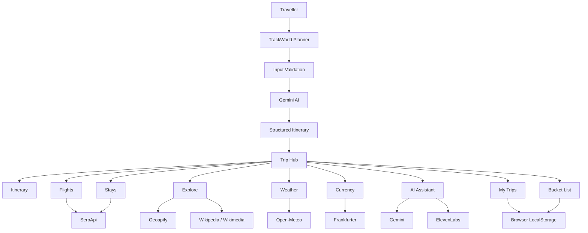
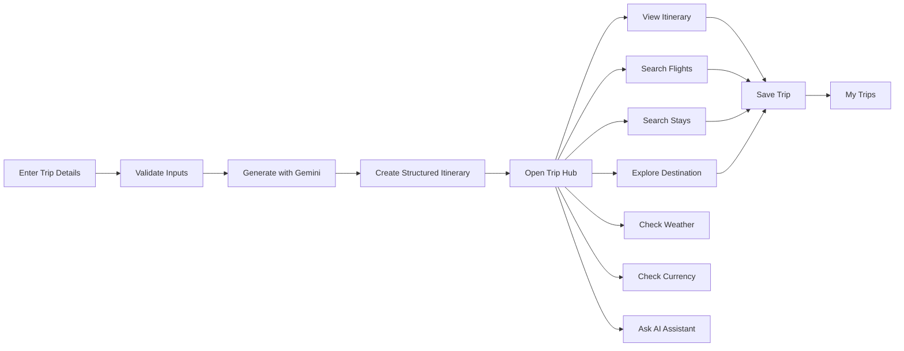
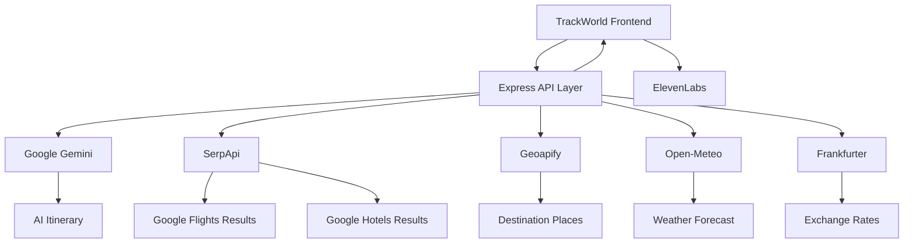
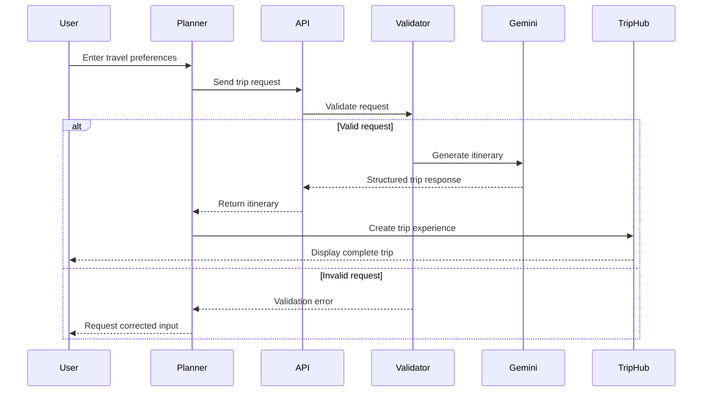
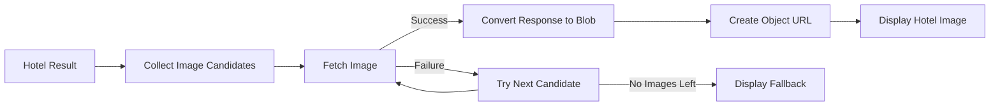
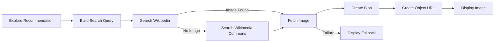
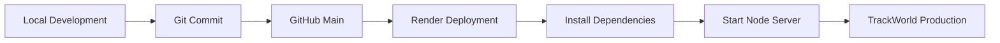
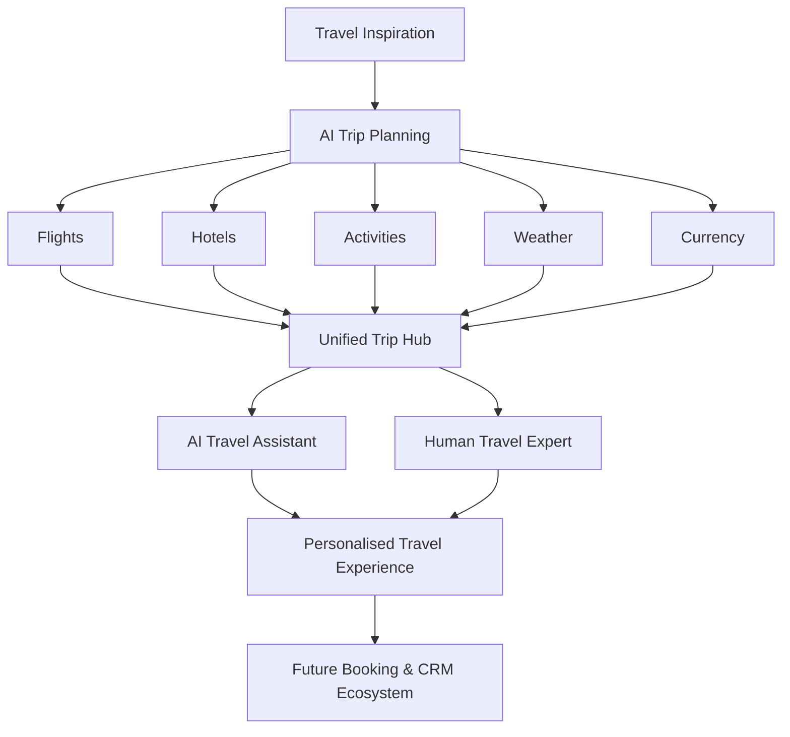

<div align="center">

# ✈️ TrackWorld AI Travel Planner

### Intelligent trip planning, live travel services, and itinerary management in one platform.

**TrackWorld Tours & Travels Pvt. Ltd.**

Built with Node.js • Express • Gemini • SerpApi • Open-Meteo • Geoapify • ElevenLabs

</div>

---

## 🌍 About TrackWorld

**TrackWorld AI Travel Planner** is an AI-assisted travel planning platform designed to simplify the complete journey from trip discovery to travel planning.

Instead of using separate platforms for itinerary creation, flights, accommodation, destination discovery, weather, currency information, and trip management, TrackWorld brings these services together in a single travel dashboard.

A traveller enters basic preferences such as:

- Departure city
- Destination
- Travel dates
- Number of travellers
- Budget
- Trip type
- Interests and preferences

TrackWorld then builds an AI-generated travel plan and provides a dedicated **Trip Hub** containing itinerary details, flight options, accommodation options, destination exploration, weather information, currency information, saved trips, bucket-list destinations, and an AI travel assistant.

---

# ✨ Key Features

### 🤖 AI-Powered Itinerary Generation

TrackWorld uses **Google Gemini** to generate structured travel itineraries based on the traveller's destination, dates, budget, interests, trip type, and other preferences.

The itinerary is organised day-by-day and designed to provide a practical balance between sightseeing, activities, food, leisure, and travel time.

---

### 🧭 Trip Hub

Every generated trip opens inside a dedicated **Trip Hub**, which acts as the central dashboard for the journey.

The Trip Hub provides access to:

- Overview
- Itinerary
- Flights
- Stays
- Explore
- AI Assistant
- My Trips
- Bucket List
- Travel Expert consultation

---

### ✈️ Live Flight Search

TrackWorld integrates **SerpApi Google Flights** to retrieve flight options based on the user's actual route and travel dates.

The system supports both:

- Departure flights
- Return flights

Airport information is dynamically resolved from the selected cities rather than relying on hard-coded routes.

---

### 🏨 Accommodation Search

Users can search for accommodation options for their destination and travel dates.

The Stays section displays information such as:

- Property name
- Accommodation image
- Rating where available
- Description
- Price
- Destination-specific results

Hotel information is retrieved through **SerpApi Google Hotels**.

Multiple provider images are supported, with graceful fallbacks when an image source is unavailable.

---

### 📍 Explore Destination

The **Explore** section helps travellers discover places around their destination.

Recommendations are organised into travel-oriented categories such as attractions, food, experiences, and other relevant places.

Destination images are dynamically resolved using sources including **Wikipedia and Wikimedia Commons**.

The image pipeline uses browser-side fetching and Blob/Object URLs for reliable rendering.

---

### 🌦 Weather Information

TrackWorld integrates **Open-Meteo** for destination weather information.

For trips within the reliable forecast window, travellers can view daily weather information for their destination.

For trips scheduled too far in the future for a reliable forecast, TrackWorld intentionally displays a forecast-unavailable state instead of fabricating weather data.

> TrackWorld never generates fake live weather information.

---

### 💱 Currency Information

TrackWorld automatically determines the relevant currencies for the trip and retrieves current exchange-rate information.

Currency conversion uses **Frankfurter** and remains based on the latest available exchange rate rather than attempting to predict future currency values for future travel dates.

Example:

`€1 EUR ≈ ₹108 INR`

---

### ✨ AI Travel Assistant

TrackWorld includes an AI travel assistant that can help users while they are planning their journey.

The assistant can use the current trip context to provide more relevant travel guidance.

The project also integrates an **ElevenLabs conversational travel assistant**, allowing the platform to support richer conversational travel experiences.

---

### 💾 My Trips

Users can save generated trips and revisit them later through the **My Trips** section.

Trip information is stored locally in the browser, allowing the application to preserve relevant user-generated travel plans without requiring a database for the current version.

---

### ♡ Bucket List

Travellers can maintain a personal **Bucket List** of destinations they are interested in visiting.

This creates a simple bridge between travel inspiration and future trip planning.

---

### 👤 Travel Expert

Users who want human assistance can access the **Talk to a Travel Expert** flow.

This complements the AI experience by allowing the platform to support a hybrid model:

**AI planning + human travel consultation**

---

# 🏗️ System Architecture



---

# 🔄 Travel Planning Flow



---

# 🔌 External Service Architecture



---

# 🧠 Itinerary Generation Flow



---

# 🏨 Stay Image Pipeline

Accommodation providers can return images from several external CDNs. TrackWorld therefore uses a controlled image-loading pipeline.



This approach improves reliability when hotel results contain images from different travel providers.

---

# 🖼️ Explore Image Pipeline



---

# 🛠️ Technology Stack

| Layer | Technology |
|---|---|
| Frontend | HTML5, CSS3, Vanilla JavaScript |
| Backend | Node.js |
| Web Framework | Express 5 |
| AI | Google Gemini |
| Flights | SerpApi / Google Flights |
| Hotels | SerpApi / Google Hotels |
| Places | Geoapify |
| Destination Images | Wikipedia / Wikimedia Commons |
| Weather | Open-Meteo |
| Currency | Frankfurter |
| Conversational Assistant | ElevenLabs |
| Client Storage | Browser LocalStorage |
| Deployment | Render |
| Version Control | Git / GitHub |

The application intentionally uses a lightweight frontend architecture without React or another frontend framework.

---

# 📡 API Architecture

The Express server exposes the following API endpoints.

| Method | Endpoint | Purpose |
|---|---|---|
| `GET` | `/api/status` | Application and service status |
| `GET` | `/api/places` | City/location search |
| `GET` | `/api/airport` | Airport resolution |
| `POST` | `/api/generate-itinerary` | Generate an AI itinerary |
| `POST` | `/api/itinerary` | Itinerary generation endpoint |
| `POST` | `/api/flights` | Search flight options |
| `POST` | `/api/stays` | Search accommodation |
| `POST` | `/api/explore` | Retrieve destination recommendations |
| `POST` | `/api/weather` | Retrieve destination weather |
| `POST` | `/api/currency` | Retrieve currency information |

All API routes are mounted under:

`/api`

---

# 📁 Project Structure

```text
trackworld-dashboard/
│
├── data/
│
├── public/
│   ├── assets/
│   │   └── travel.jpg
│   │
│   ├── js/
│   │   ├── api.js
│   │   ├── bucket-list-page.js
│   │   ├── main.js
│   │   ├── planner.js
│   │   ├── state.js
│   │   ├── support.js
│   │   ├── trip-page.js
│   │   ├── trip.js
│   │   └── trips-page.js
│   │
│   ├── index.html
│   ├── trip.html
│   ├── trips.html
│   ├── bucket-list.html
│   │
│   ├── styles.css
│   ├── trip.css
│   ├── trips.css
│   └── bucket-list.css
│
├── scripts/
│
├── src/
│   ├── config.js
│   ├── gemini.js
│   ├── location-data.js
│   ├── routes.js
│   ├── travel-services.js
│   └── validation.js
│
├── .env.example
├── .gitignore
├── package.json
├── package-lock.json
├── server.js
└── README.md
```

---

# ⚙️ Backend Structure

The backend is intentionally separated into focused modules.

### `server.js`

Responsible for:

- Express application bootstrap
- JSON request handling
- Static frontend delivery
- API router mounting
- SPA fallback
- Error handling
- Production caching behaviour

### `src/routes.js`

Contains the TrackWorld API endpoints and connects validated frontend requests to the appropriate travel services.

### `src/gemini.js`

Handles communication with Google Gemini and the AI itinerary-generation workflow.

### `src/travel-services.js`

Handles external travel services including flight, accommodation, weather, currency, and related provider integrations.

### `src/location-data.js`

Provides location-related functionality used by the planner and airport/city resolution systems.

### `src/validation.js`

Validates incoming requests before they reach external services.

### `src/config.js`

Centralises environment-based application configuration.

---

# 🔐 Environment Variables

Create a `.env` file in the project root.

Use `.env.example` as the template.

```env
PORT=3000
NODE_ENV=development

AI_MODE=gemini
GEMINI_API_KEY=your_gemini_api_key_here
GEMINI_MODEL=gemini-3.6-flash
MAX_GEMINI_REQUESTS=10
GEMINI_TIMEOUT_MS=45000

SERPAPI_API_KEY=your_serpapi_api_key_here
SERPAPI_BASE_URL=https://serpapi.com/search.json
SERPAPI_TIMEOUT_MS=20000

GEOAPIFY_API_KEY=your_geoapify_api_key_here
GEOAPIFY_BASE_URL=https://api.geoapify.com/v2
GEOAPIFY_TIMEOUT_MS=15000

OPEN_METEO_BASE_URL=https://api.open-meteo.com/v1
OPEN_METEO_TIMEOUT_MS=15000

FRANKFURTER_BASE_URL=https://api.frankfurter.app
FRANKFURTER_TIMEOUT_MS=15000

ELEVENLABS_AGENT_ID=your_elevenlabs_agent_id
ELEVENLABS_BRANCH_ID=your_elevenlabs_branch_id

CACHE_TTL_MINUTES=1440
ITINERARY_CACHE_TTL_MINUTES=1440
FLIGHT_CACHE_TTL_MINUTES=15
STAY_CACHE_TTL_MINUTES=30
EXPLORE_CACHE_TTL_MINUTES=1440
WEATHER_CACHE_TTL_MINUTES=60
CURRENCY_CACHE_TTL_MINUTES=360
```

> **Never commit your real `.env` file or API keys to GitHub.**

The repository's `.gitignore` is configured to exclude private environment files.

---

# 🚀 Running TrackWorld Locally

### 1. Clone the repository

```bash
git clone https://github.com/blaze2310/trackworld-dashboard.git
```

### 2. Enter the project

```bash
cd trackworld-dashboard
```

### 3. Install dependencies

```bash
npm install
```

### 4. Configure environment variables

Create your local `.env` file using:

```bash
cp .env.example .env
```

Add your own API credentials to `.env`.

### 5. Start TrackWorld

```bash
npm start
```

### 6. Open the application

Open:

`http://localhost:3000`

---

# 🧪 Development Mode

Node's watch mode can be used during development:

```bash
npm run dev
```

The project requires:

**Node.js 20 or newer**

---

# ✅ Code Validation

Before committing changes, run:

```bash
npm run check
```

The project also uses Node's syntax checker for the Trip Hub module:

```bash
node --check public/js/trip-page.js
```

Git whitespace validation can be performed with:

```bash
git diff --check
```

---

# 🛡️ Security & Reliability

TrackWorld follows several safeguards for API-based travel planning.

### Environment Security

API credentials are stored in environment variables rather than frontend source files.

The `.env` file is excluded from Git.

### Request Validation

Incoming API requests are validated before being passed to external services.

### JSON Protection

The Express server limits JSON request bodies and provides dedicated handling for invalid JSON.

### Server Information

Express's `X-Powered-By` header is disabled.

### API Failure Handling

External travel services can occasionally be unavailable or return incomplete information.

The interface therefore provides controlled fallback states instead of allowing individual provider failures to break the complete Trip Hub.

### Live Data Integrity

TrackWorld does not intentionally fabricate live travel information.

For example:

- Weather outside the reliable forecast period is shown as unavailable.
- Currency information uses current available rates.
- Flight and accommodation results depend on provider availability.

---

# 💾 Data & Persistence

The current version does not require a traditional user database for saved trips.

Browser storage is used for features such as:

- Saved trips
- My Trips
- Bucket List
- Relevant trip state

This keeps the architecture lightweight while leaving room for future account-based cloud persistence.

---

# ⚡ Caching Strategy

Different services have different freshness requirements.

For example:

| Data | Typical Cache Strategy |
|---|---|
| AI Itinerary | Long-lived |
| Flights | Short-lived |
| Stays | Short-lived |
| Explore | Long-lived |
| Weather | Short-lived |
| Currency | Periodic refresh |

Cache durations are configurable through environment variables.

This reduces unnecessary API requests while ensuring time-sensitive information can refresh more frequently.

---

# 🎯 Design Philosophy

TrackWorld was designed around four principles:

**1. One travel workspace**

Travellers should not need several disconnected websites simply to understand one trip.

**2. AI where it adds value**

AI is used for personalised itinerary creation and travel assistance rather than pretending to replace live travel-data providers.

**3. Real data for real-world information**

Flights, accommodation, weather, currency, and destination information are connected to specialised external services.

**4. Graceful failure**

If a third-party provider cannot return information, the rest of the travel experience should continue working.

---

# 🚀 Deployment

TrackWorld is designed to run as a Node.js web service and is deployed using **Render**.

Production configuration should be provided through Render environment variables rather than committing credentials to the repository.

Typical production flow:



---

# 🔮 Future Scope

The current architecture can be extended with:

- User authentication and profiles
- Cloud database persistence
- Cross-device saved trips
- Collaborative trip planning
- Direct flight booking integrations
- Direct hotel booking integrations
- Payment gateway integration
- Booking history
- Travel documents and voucher management
- Visa information
- Travel insurance integration
- Real-time flight status
- Notifications and price alerts
- Map-based itinerary visualisation
- AI itinerary regeneration by individual day
- Expense tracking
- Multi-city trip planning
- Mobile application
- Multilingual travel assistant
- CRM integration for travel experts
- Customer enquiry management
- Analytics dashboard for TrackWorld
- Recommendation learning based on traveller preferences

---

# 🧩 Platform Vision



---

# 👨‍💻 Project

**TrackWorld AI Travel Planner**

Developed as a modern AI-assisted travel planning platform for:

**TrackWorld Tours & Travels Pvt. Ltd.**

The project combines software development, AI-assisted itinerary generation, live travel-data integration, and travel-business workflows into one unified platform.

---

<div align="center">

### 🌍 Plan smarter. Explore further. Travel with TrackWorld.

**TrackWorld Vacations**

</div>
